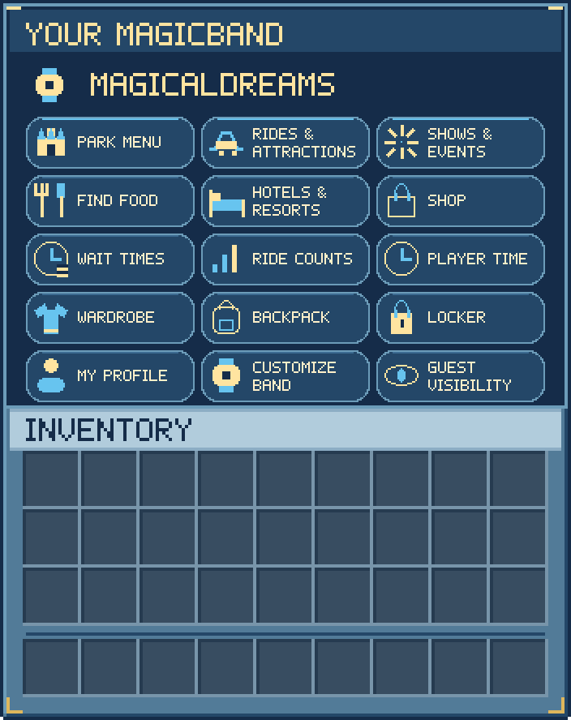

# MagicBand home screen

The Parks pack contains a blue-and-gold home screen with 15 rounded buttons. Each button spans three inventory slots with identical actions and hover tooltips. The top row is decorative. Other MagicBand pages keep their existing layouts.



This is a 4× GUI-scale asset composite, not an in-game screenshot. Artwork is authored at 2× GUI resolution (352×252) with finer icons and 5×7 lettering; the tagline is omitted. Minecraft supplies the actual player name/title color, inventory contents and hover tooltips. The title is never baked into the runtime texture. The underlying hit areas remain square, with the normal two-pixel gaps between slots. `hit-areas.png` shows those regions in pink.

## Authoring

The source is deterministic pixel drawing, matching the existing `ui-blue` palette and `menu-icons` approach. No generated-image service or external artwork is required. With Python 3 and Pillow:

```sh
python3 magicband-ui/draw_magicband.py
python3 magicband-ui/validate_magicband.py --java ../ParkManager-Module
python3 -m unittest discover -s magicband-ui -p "test_*.py"
python3 scripts/build_packs.py
```

`draw_magicband.py --output /tmp/magicband-preview` stages assets and previews without modifying the pack. The generator rejects shared paper-model edits before writing any files; merge those changes manually before regenerating. Keep `layout.json`, the generator's entries, and ParkManager's `MagicBandMenuLayout.java` synchronized when changing button positions.

## Runtime contract

- The custom menu is a six-row chest (54 slots). Rows 2–6 contain the 15 buttons, ordered as in `layout.json`.
- `assets/magicaldreams/textures/gui/magicband/home.png` is an opaque 352×252 texture displayed as a 176×126 GUI-pixel panel. It only covers the upper chest region; the player's inventory remains usable for viewing below it.
- `magicaldreams:magicband` is referenced by `minecraft:default`. U+E7A0 advances −8 pixels, U+E7A1 renders the panel at height 126/ascent 13, and U+E7A2 advances −169 pixels to restore the title origin. The plugin renders the panel white before applying the player's chosen title color.
- Paper CustomModelData **730001** is reserved for invisible tooltip/hit-area items. The legacy model override supports Java 1.21.1–1.21.3; the modern item definition uses `range_dispatch` and `minecraft:empty` for 1.21.4+. Both return to ordinary paper at 730002; other integer CMD values are unaffected.
- Assets are exclusive to **Parks RP**. Generic RP is unchanged.

## Rollout and in-game verification

Publish the updated Parks ZIP through the existing resource-pack workflow, update its URL/hash in MDCore's managed pack definition, then install the matching ParkManager build. A pack reported as loaded cannot tell the plugin whether it contains this particular asset revision, so deploy the pack first.

ParkManager enables the panel with `[magicband] custom_menu = true` (also the default when absent in an existing config). Set it to `false` to retain the classic 27-slot home screen. The optional `pack_definition_id` restricts the skin to the MDCore Parks pack definition UUID; empty trusts the managed pack assigned to this park server. Pending, failed, unloaded and unavailable managed pack states use the classic screen when the menu opens.

In staging, check GUI scale Auto/2/3/4, a long player name and title colors, tooltips across all three thirds of each button, every destination, visibility switching, profile refresh, inventory click/drag cancellation and the classic fallback. Verify older supported clients if the server accepts them. Offline tests validate alignment mathematically, but client rendering and any other enabled packs still require an in-game check.
